# MetaTron version 1.0.0
<p align="center">
   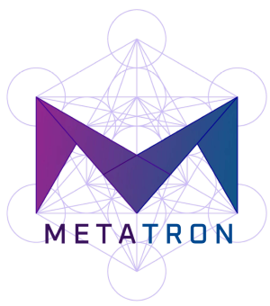
</p>
MetaTron is an open-source, collaborative, web-based annotation targeting the biomedical domain. 
All the source code, the installation guidelines, and instructions to use the tool are availanle in this repository.

A set of videos illustrating the instructions on how to perform annotations and an overview of the features that MetaTron provides is available at: https://metatron.dei.unipd.it/demo
## Requirements
MetaTron is available online at http://metatron.dei.unipd.it. In order to locally deploy MetaTron in your computer or in a remote server you need Docker and docker-compose. To install them, you can follow the instructions available at: https://docs.docker.com/get-docker/ (Docker) and https://docs.docker.com/compose/install/ (docker-compose). 

Clone or donwload this repository. Open the **metatron** folder and, replace the url provided in the url.txt file with the url of the server where MetaTron will be deployed. Your url must replace the default one: http://0.0.0.0:8000. 

Run a new terminal session and run ```docker-compose up```. This procedure will take some minutes depending on your hardware and you internet connection. When the procedure is finished you can open a new browser winodw (chrome is recommended) and you can start uploading new documents.


## Annotation Interface
In the annotation interface you can visualize your annotations and annotate collections' documents.
<p align="center">
   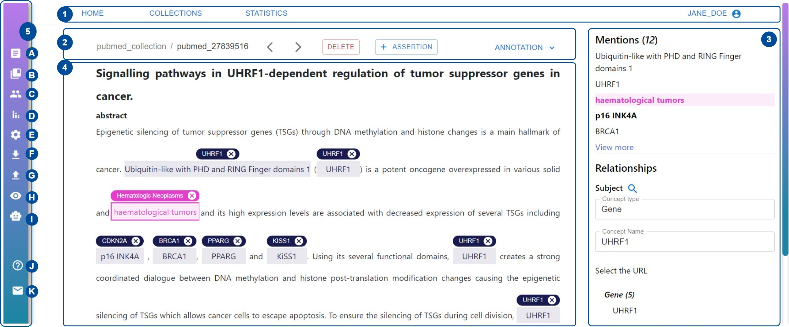
</p>

   1. In the main header it is possible to logout, and access to statistics and collections pages;
   2. In the document header it is possible to change document, change collection, annotate a new assertion, delete the annotation for the document, and open annotation panel;
   3. The annotation panel allows you to visualize you annotations performed for each type;
   4. The part of the page where the textual document is;
   5. Vertical toolbar which allows users to: change collection, filter documents, chack other users' annotations, get an overview of the statistics of the collection, customize colors and font, upload new documents, concepts, annotations, download the annotation, automatically annotate the documents (from A to J in the figure).

## Customizability and Collections
MetaTron allows the users to create one or more  _collections_: a collection contains one or more documents which can be annotated by one or more users. To create a new collection go to COLLECTIONS button at the top of the main interface which will redirect to the collections page. This page contains the list of collections a user can annotate and a form to create a new collection. 

The collections a user can annotate contain the following information: creator, date of creation, descriptions, documents, number of annotators, annotators' names, labels list. It is possible to interact with the collections, in particular it is possible to:
1. load more information;
2. have an overview of the documents of the collection and the related annotations;
3. annotate the collection;
4. delete the collection (for the creator only)

<p align="center">
   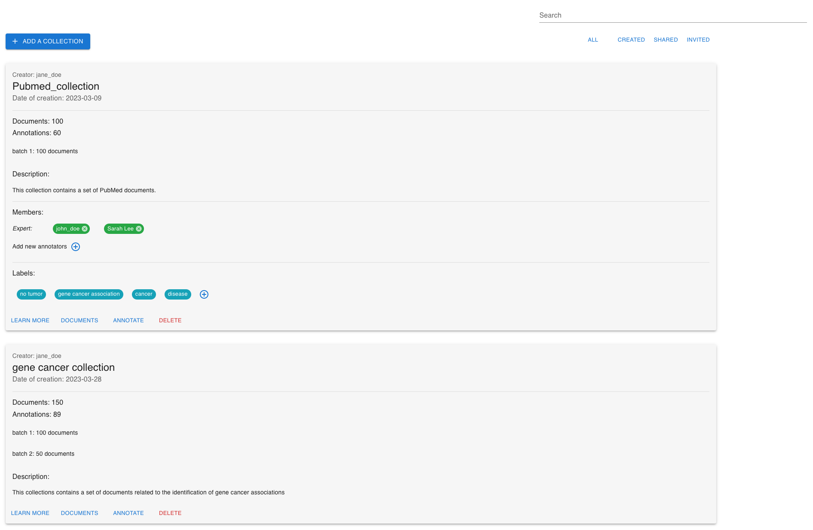
</p>

The documents page contains a table where each document is a row of the table. For each document it is possible to keep track of the annotation of each type. Users can see other annotators' annotations and download the related annotations.

<p align="center">
   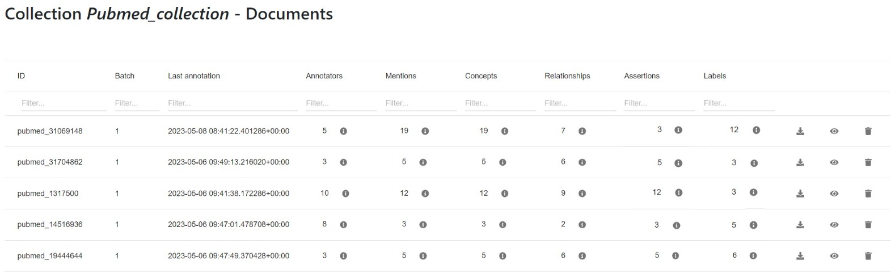
</p>

To create a new collection, click on ADD COLLECTION to open the form. To create a new collection the following information should be provided: (i) name, (ii) description, (iii) a list of members who can annotate the collection; (iv) a file containing the concepts that can be linked to the mentions or added in relationships and assertions; (v) one or more textual documents: documents can be uploaded in JSON, CSV, PDF, TXT; it is possible to annotate pubmed abstracts by providing a list of PMIDs, abstract from semantics scholar and openaire by providing a list of DOIs. In this case, the integration with external rest apis allows to automatically get the abstracts; (vi) a list of labels that can be used to classify the documents. Labels, members and documents can be updated at any time.
When a new member is added, it will not be automatically able to annotate the collection: an invitation is sent to them, and then, once that they accept the invitation, they will be able to annotate the documents.


## Annotations 
### Mention-level annotations
MetaTron provides three types of mention-level annotation. Mention-level annotations concern specific text-spans inside the document's textual content, hence, they do not consider the entire document. Mention-level annotations are: (i) mentions annotation, (ii) concepts linking, and (iii) relationship annotation.

**Mentions annotation**
Mentions are text-spans in a textual document which can be linked to an entity in a knowledge base. There are three possible mention annotation procedures:

1. if the mention includes a single word, intended as a sequence of characters between two white-spaces, you can double-click on the word;
2. If the mention includes two or more words, just click on the first and last words and the sequence of adjacent words will be automatically annotated;
3. If the mention is a substring of one or more words (hence it is not comprised within two white spaces), drag and drop from the first to the last character you want to annotate

MetaTron supports overlapping mentions.
When a mention is selected, it will be highlighted in blue color.

**The mention panel**
When a new mention is selected, it is possible to open a mention panel by right-clicking on the mention. A menu with a set of options is displayed, in particular, from the mention panel it is possible to:

1. Get more information about the mention -- i.e., the time of annotation and the number of annotators who annotated the mention;
2. Receive some suggestions about the concepts that can be associated to the mention; users can have an overview of all the concepts that have been associated to the mention by their teammates and select to associate to the mention one or more of these concept.
3. Link a new concept;
4. Add a relationship;
5. Delete the mention.

<p align="center">
   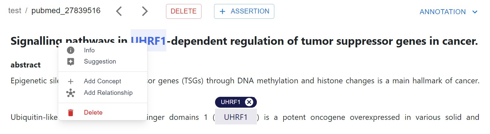
</p>


**Concepts linking**
It is possible to link a concept to a mention. Concepts are named entitied belonging to an ontology. 

To associate a new concept to a mention, right-click on the mention and select the option ```Add concept```: a new modal will appear and you are asked to provide the following information: concept type -- i.e., a macro area the concept belongs to, such as _gene _or _disease_; the concept name which is the name of the concept, and the concept ID (necessary only if there is more than one concept with that name). The concepts you can choose from belong to a list of concepts added at the moment of the collection creation. If the concept you are looking for is not in the list, it is possible to add it by providing the following information: area, name, ID, description (this is optional).  
<p align="center">
   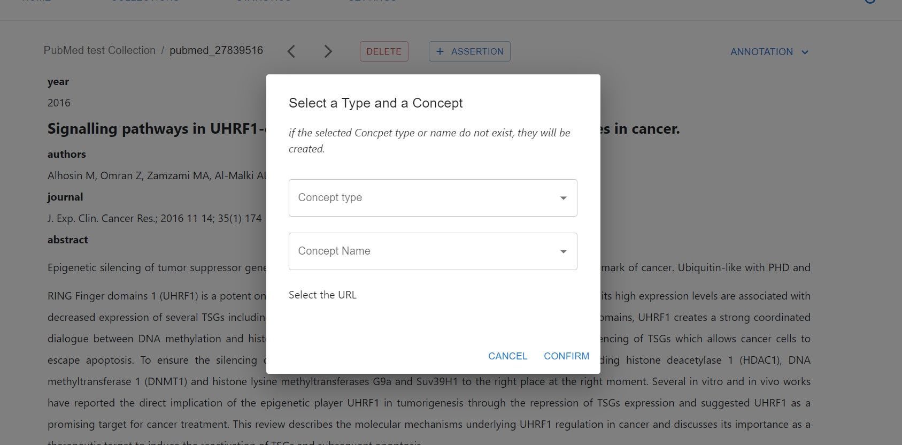
</p>

**Relationship annotation**
A relationship is composed of three main elements: a subject, a predicate, and an object. At least one of these three elements must be a mention; the other two elements can be concepts unlinked to any mention. 

To annotate a new relationship, start selecting the mention that will be part of your mention, once selected the mention it will be the subject of the relationship by default; you can change the role of the mention by right clicking on it: a drop down menu will appear and you can select one between subject, predicate and object. To annotate other mentions that take part in the relationship, just click on them and change the role (if needed). To add new concepts to the relationship, the menu on the right allows to open the concepts modal (the same used in the concepts linking) where it is possible to select the desired concept. 

<p align="center">
   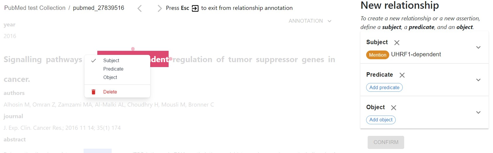
</p>
<p align="center">
   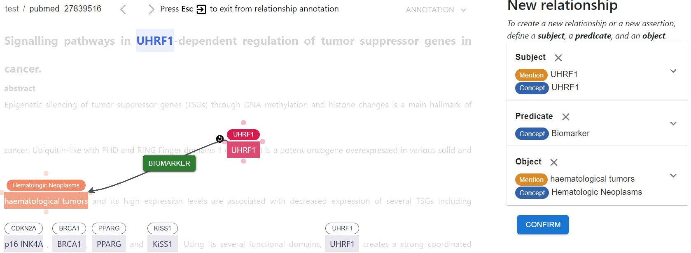
</p>

### Document-level annotations
Document-level annotation concern the entire document content and are not tied to a specific text span. Document-level annotations are: (i) labels annotation; (ii) assertions annotations.
 
 **Labels annotation**
 Labels are categories used to classify a textual document. To add, edit, remove a label, open the annotation panel by clicking on the ANNOTATION button in the annotation interface and select the label option from the drop-down list. Once that the menu on the right opens up, you can click on the desired labels to select or deselect them. Your selection is automatically saved.
 

<p align="center">
   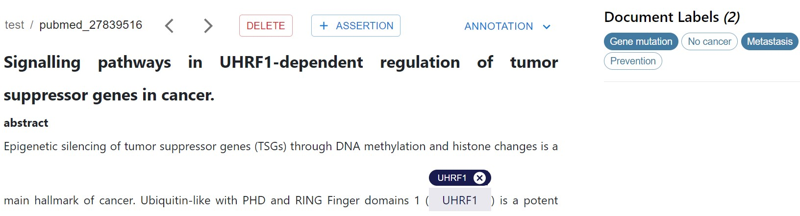
</p>

 **Assertions annotation**
Assertions are relationships between three distinct concepts that can be inferred from the document content. Concepts are not tied to any mention. To select a new assertion click on the button "+ ASSERTION". A panel on the right will open with the possibility to select the concepts composing the assertion.


## AutoTron and the Automatic Annotation
It is possible to automatically annotate the documents relying on AutoTron which provides built-in predictions for assertion and relationship annotation. Two tasks have been implemented: _GCA - Gene Cancer Association_ and _GDA - Gene Disease Association_. AutoTron will automatically annotate mentions, link concepts, and relationships (or assertions).

<p align="center">
   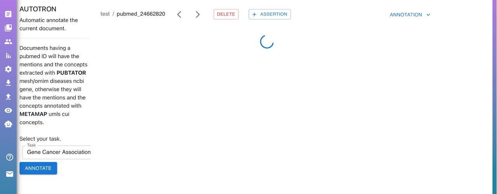
</p>

### The annotation panel
The annotation panel can be opened by clicking on the ANNOTATION button in the annotation interface. It is possible to select one or more annotation types; then, all the annotations will be displayed and it is possible to view, edit and remove the desired annotations.

## Collaboration
Users can collaboratively annotate the documents of a collection. Specifically, from the vertical toolbar it is possible to access to the annotations of other different users, as well as the annotation with the highest value of majority voting. Users can copy some (as well as all) the annotations of the teammates. 

The statistics web page allows users to keep track of the annotations performed in the collection. In particular it is possible to check _personal_ and _global_ statistics. Personal statistics concern the user, while global statistics concern all the annotators. It is possible to check the statistics of one document or of the entire collection. 

Below an example of global statistics concerning the entire collection.
<p align="center">
   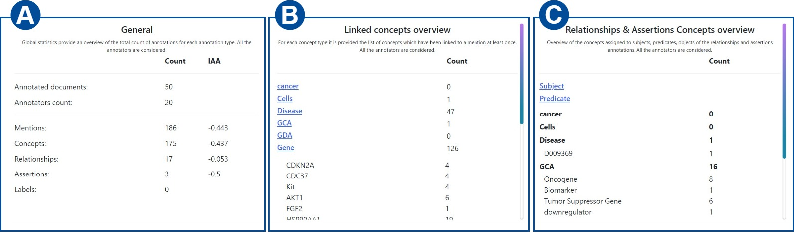
</p>

In (A) an overview is provided: for each annotation type the total number of annotations is displayed, as well as the number of documents and the number of annotators. The agreement is based on fleiss' kappa. In (B), for each concept type it is provided the related list of concepts and how many times have been linked to a mention. The same has been done in (C): in this case we considered for each concept, how many times has been annotated as subject, predicate, object respectively.

<p align="center">
   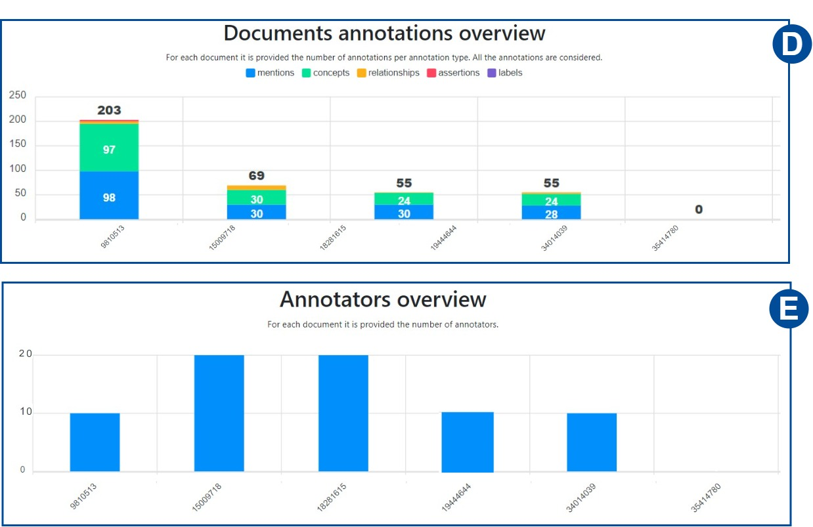
</p>
In (D) for each document, it is provided the number of annotations subdivided into annotation types; in (E) the number of annotators for each document is provided.

<p align="center">
   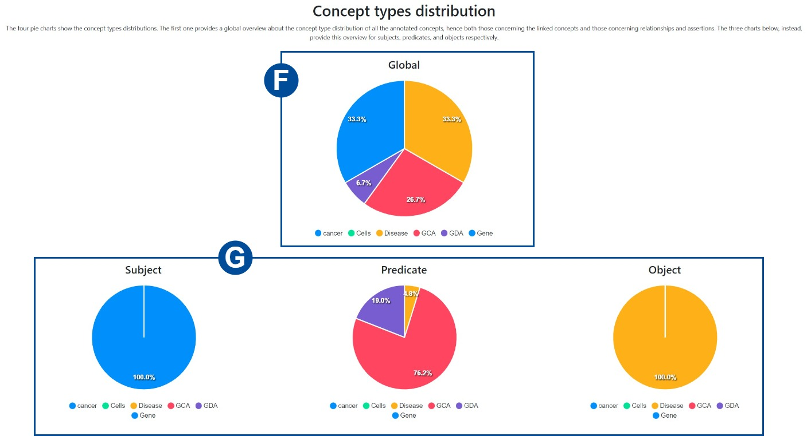
</p>
The pie charts allows users to check how concepts types are distributed. Global considers all the annotations involving concepts and shows for each concept type how many times has been annotated; subject, predicate and object instead, refer only to relationships and assertions.

# Citation
If you use MetaTron for your research work, please consider citing our paper:

  ```bibtex
@inproceedings{irrera_etal-2024,
  author       = {Ornella Irrera and Stefano Marchesin and Gianmaria Silvello},
  title        = {MetaTron: advancing biomedical annotation empowering relation annotation
                  and collaboration},
  journal      = {{BMC} Bioinformatics},
  volume       = {25},
  number       = {1},
  pages        = {112},
  year         = {2024},
  url          = {https://doi.org/10.1186/s12859-024-05730-9},
  doi          = {10.1186/S12859-024-05730-9}
}
```

# Credits

MetaTron has been developed by the [Intelligent Interactive Information Access Hub (IIIA)](http://iiia.dei.unipd.it/) of the  [Department of Information Engineering](https://www.dei.unipd.it/en/), [University of Padua](https://www.unipd.it/en/), Italy.


## Acknowledgements 

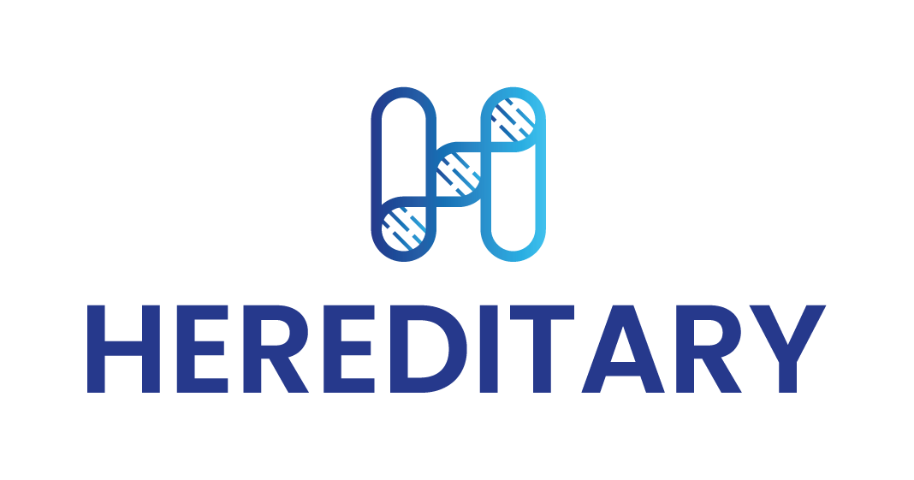

This work was supported by [HEREDITARY](https://www.hereditary.eu/), European Union Horizon 2020 program under Grant Agreement no. 101137074.

## Contacts

Any questions? The authors are glad to answer your questions and receive your feedback or suggestions to further improve MedTAG. 

- [Ornella Irrera](http://www.dei.unipd.it/~irreraorne) · ornella.irrera AT unipd.it
- [Stefano Marchesin](https://www.dei.unipd.it/~marches1/) · stefano.marchesin AT unipd.it
- [Gianmaria Silvello](http://www.dei.unipd.it/~silvello/) · gianmaria.silvello AT unipd.it
